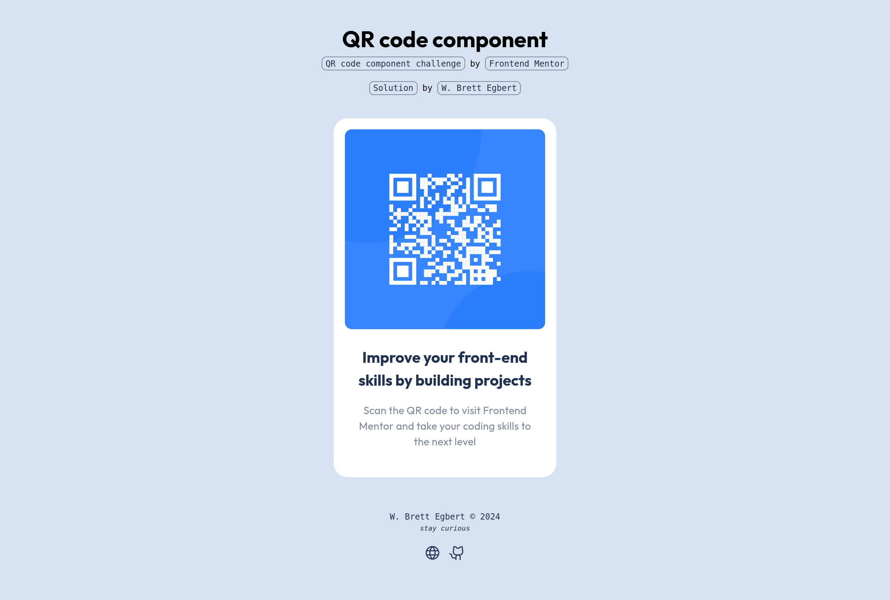

# Frontend Mentor - QR code component solution

This is a solution to the [QR code component challenge on Frontend Mentor](https://www.frontendmentor.io/challenges/qr-code-component-iux_sIO_H). Frontend Mentor challenges help you improve your coding skills by building realistic projects. 

## Table of contents

- [Frontend Mentor - QR code component solution](#frontend-mentor---qr-code-component-solution)
  - [Table of contents](#table-of-contents)
  - [Overview](#overview)
    - [Screenshot](#screenshot)
    - [Links](#links)
  - [My process](#my-process)
    - [Built with](#built-with)
    - [What I learned](#what-i-learned)
    - [Continued development](#continued-development)
    - [Useful resources](#useful-resources)
  - [Author](#author)

**Note: Delete this note and update the table of contents based on what sections you keep.**

## Overview

### Screenshot



### Links

- Solution URL: [github](https://github.com/crossinguard/fm-qr-code-component)
- Live Site URL: [qr-component.crossinguard.dev](https://qr-component.crossinguard.dev/)

## My process

### Built with

- [Astro](https://astro.build/) - web framework
  - starting point: blank template

- HTML, CSS, TypeScript - coding languages
- [GitHub](https://github.com/) - git repository host
- [Netlify](https://www.netlify.com/) - web host platform

### What I learned

I had two focuses going into this challenge.

1. Make my solution an Astro component that could be easily customized in the future with different QR codes, heading text, and body text.
2. Create my solution page with core elements and components that could be reused across many Frontend Mentor challenges.

Regarding the first focus, I created my component `Card.astro` with four props identifying the images and text used in the component. This ensures core elements of the QR code component can be easily altered while using it. More refined changes would happen directly within the `Card.astro` component's style section.

```html
<Card
    qr_path="/src/assets/qr-code.svg"
    background_path="/src/assets/oval.svg"
    heading_text="Improve your front-end skills by building projects"
    body_text="Scan the QR code to visit Frontend Mentor and take your coding skills to the next level">
</Card>  
```

Astro optimizes images for web use, but requires those images to be imported prior to use. I followed [this guide on dynamically importing images](https://docs.astro.build/en/recipes/dynamically-importing-images/) within the Astro docs to allow my component to accept image paths as props.

I decided to make the QR code itself and it's background as two separate image layers within the component, with the QR code stacked on top. That allows either to be manipulated. However, I was struggling with how to position them without using absolute positioning. SmolCSS with the [stack layout](https://smolcss.dev/#smol-stack-layout) to the rescue! The component itself is a fixed size currently, but this is more future-proof than assuming it will never resize in future iterations.

To accomplish my second goal I created a `site.json` file to feed information to many of the layouts and components of my solution site. I then reworked the layouts, headers, social, and footers to automatically update from that file.

```json
{
  "website": {
    "title": "crossinguard.dev",
    "description": "Challenges completed as part of the Frontend Mentor learning paths.",
    "url": "https://crossinguard.dev/",
    "language": "en"
  },
  "author": {
    "name": "W. Brett Egbert",
    "handle": "crossinguard",
    "social": [
      {
        "name": "Website",
        "url": "https://crossinguard.dev/",
        "icon": "globe"
      },
      {
        "name": "GitHub",
        "url": "https://github.com/crossinguard",
        "icon": "github-logo"
      }
    ]
  },
  "challenge": {
    "name": "QR code component",
    "challenge_url": "https://www.frontendmentor.io/challenges/qr-code-component-iux_sIO_H",
    "frontendmentor_url": "https://www.frontendmentor.io?ref=challenge"
  },
  "solution": {
    "github_url": "https://github.com",
    "repository": "fm-qr-code-component"
  }
}
```

The challenge and solution data can now be easily updated for each new project, allowing the solution to be a standalone component nested within the base layout.

```html
<ChallengeLayout>
    <section class="center">
        <Card> 
            ...
        </Card>        
    </section>
</ChallengeLayout>
```

### Continued development

This was created with a fixed size to match the design parameters. However, I think this component would benefit from accepting a prop for the QR code size and base font size, then dynamically adapting all supporting elements based on those props.

### Useful resources

- [Dynamically import images | Astro docs](https://docs.astro.build/en/recipes/dynamically-importing-images/) - For creating an Astro component that accepts an image path as a prop
- [Smol Stack Layout | SmolCSS](https://smolcss.dev/#smol-stack-layout) - For the QR code and background layering without using absolute positioning
- [3 Popular Website Heroes Created With CSS Grid Layout | Modern CSS](https://moderncss.dev/3-popular-website-heroes-created-with-css-grid-layout/#hero-2-text-overlay-on-background-image) - Extra information regarding the stack layout in a hero

## Author

- Website - [W. Brett Egbert | crossinguard.dev](https://crossinguard.dev/)
- Frontend Mentor - [@crossinguard](https://www.frontendmentor.io/profile/crossinguard)
